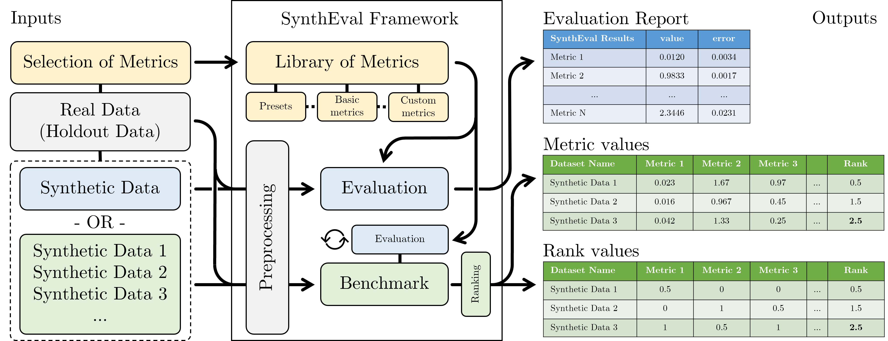

[](https://badge.fury.io/py/syntheval)
[](https://github.com/schneiderkamplab/syntheval/actions/workflows/doctests.yml)

# SynthEval
The SynthEval library is a framework for evaluating the fidelity of tabularised synthetic data compared with real data. Synthetic data is microdata that is artificially generated and thus does not directly correspond to real-world individuals, making it a possible alternative to regular data anonymity. This tool builds on many previous works and compiles them into a single tool to make the evaluation of synthetic data utility and privacy easier for data scientists and researchers alike.

<p align="center">
  
</p>

## Latest version
The current version of the tool offers a wide selection of metrics, to evaluate how well your synthetic data aligns on privacy and utility. In the current version several metrics are available, and can be used in preconfigured or custom evaluation reports. The benchmark module enables multiaxis comparison of several synthetic versions of the same dataset in parallel.  

If you use our library in your work, you can reference us by citing our paper:
```
@article{Lautrup2024,
  author = {Lautrup,  Anton D. and Hyrup,  Tobias and Zimek,  Arthur and Schneider-Kamp,  Peter},
  title = {Syntheval: a framework for detailed utility and privacy evaluation of tabular synthetic data},
  publisher = {Springer Science and Business Media LLC},
  journal = {Data Mining and Knowledge Discovery},
  doi = {10.1007/s10618-024-01081-4},
  year = {2024},
  volume = {39},
  number = {1},
}
```

## Installation
Installation with PyPI using
```
pip install syntheval
```

## User guide
In this section, we briefly outline how to run the main analysis. The library is made to be run with two datasets that look similar, i.e. same number of columns, same variable types and same column and variable names, and will raise errors if that is not the case. The data should be supplied as a pandas dataframes. 
In Python the library is accessed and run in the following way;
```python
from syntheval import SynthEval

evaluator = SynthEval(df_real, holdout_dataframe = df_test, cat_cols = class_cat_col)
evaluator.evaluate(df_fake, class_lab_col, presets_file = "full_eval", **kwargs)
```
Where the user supplies <code>df_real, df_test, df_fake</code> as pandas dataframes, the <code>class_cat_col</code> is a complete list of column names (which can be omitted for categoricals to be automatically inferred). Some metrics require a target class, so <code>class_lab_col</code> is a string for designating one column with discrete values as a target for usability predictions and colouration. In the evaluate function, a presets file can be chosen ("full_eval", "fast_eval", or "privacy") or alternatively, a filepath can be supplied to a json file with select metrics keywords. Finally, instead of (or in addition to), keyword arguments can be added in the end with additional metrics and their options. 

New in version 1.4 is the benchmark module, that allows a directory of synthetic datasets to be specified for evaluation (or a dictionary of dataframes). All datasets in the folder are evaluated against the training (and test) data on the selected metrics. Three types of rank-derived scoring are available to choose between ("linear", "normal", or "quantile"), assisting in identifying datasets that perform well overall, and on utility and privacy dimensions.
```python
evaluator.benchmark('local/path_to/target_dir/', class_lab_col, presets_file = "full_eval", rank_strategy='normal', **kwargs)
```
Linear ranking is appropriate for datasets where the results are spaced out, e.g. when the synthetic datasets are generated with different methods. Normal ranking works for identifying the datasets that does best/worst out of a normally distributed mass (as you would expect during hyperparameter tuning). Quantile ranking is suitable for benchmarks of several datasets, where multiple winners may be selected from each metric.

For more details on how to use the library, see the codebooks below;
| Notebook | Description |
| --- | --- |
| [Tutorial 1](guides/syntheval_guide.ipynb) | Get started, basic examples |
| [Tutorial 2](guides/syntheval_benchmark.ipynb) | Dataset benchmark, evaluating and ranking synthetic datasets in bulk |
| [Tutorial 3](https://github.com/schneiderkamplab/syntheval-model-benchmark-example/blob/main/syntheval_model_benchmark.ipynb) | Model benchmark example, evaluating and ranking models |

### Command line interface
SynthEval can also be run from the commandline with the following syntax:
```
> syntheval [OPTIONS] [EVALUATE]

Options:
  -r, --real-data-file PATH     Path to csv file with real data.
  -s, --synt-data-file PATH     Path to csv file with synthetic data.
  -h, --test-data-file PATH     Path to csv file with real data that wasn't
                                used for training.
  -j, --evaluation-config TEXT  Name of preset file or filepath to custom json
                                config file.
  -l, --category-labels PATH    Path to txt file with comma separated labels.
  -c, --class-label TEXT        Label to use for prediction usability and
                                coloring on plots.
  --help                        Show this message and exit.
```

## Included metrics overview
The SynthEval library comes equipped with a broad selection of metrics to evaluate various aspects of synthetic tabular data. One of the more interesting properties that makes SynthEval stand out is that many of the metrics have been carefully adapted to accept heterogeneous data. Distances between datapoints are (by default) handled using Gower's distance/similarity measure rather than the Euclidean distance, which negates any requirement of special data encoding.

### Utility Metrics
Utility analysis entails resemblance, quality and usability metrics testing how well the synthetic data looks like, behaves like, and substitutes like the real data.

In the code we implemented:
- Dimension-Wise Means (nums. only, avg. value and plot)
- Principal Components Analysis (nums. only, plot of first two components)
- Confidence Interval Overlap (nums. only, number and fraction of significant tests)
- Correlation Matrix Difference (mixed correlation)
- Mutual Information Matrix Difference
- Kolmogorov–Smirnov / Total Variation Distance test (avg. distance, avg. p-value and number and fraction of significant tests)
- Hellinger Distance (avg. distance)
- Propensity Mean Squared Error (pMSE and accuracy)
- Prediction AUROC difference (for binary target variables only)
- Nearest Neighbour Adversarial Accuracy (NNAA) 

### classification accuracy
In this tool we test useability by training four different <code>sklearn</code> classifiers on real and synthetic data with 5-fold cross-validation (testing both models on the real validation fold). 
- DecisionTreeClassifier
- AdaBoostClassifier
- RandomForestClassifier
- LogisticRegression

The average accuracy is reported together with the accuracy difference from models trained on real and synthetic data. If a test set is provided, the classifiers are also trained once on the entire training set, and again the accuracy and accuracy differences are reported, but now on the test data.

By default the results are given in terms of accuracy (micro F1 scores). To change, use ‘micro’, ‘macro’ or ‘weighted’ in the preset file or in kwargs.

### Privacy Metrics
Privacy is a crucial aspect of evaluating synthetic data, we include only three highlevel metrics with more to be added in the future.
- Nearest Neighbour Distance Ratio (NNDR)
- Privacy Losses (difference in NNAA and NNDR between test and training sets, good for checking overfitting too.)
- Median Distance to Closest Record (normalised by internal NN distance.)
- Hitting Rate (for numericals defined to be within the attribute range / 30)
- Epsilon identifiability risk (calculated using weighted NN distance)
- Membership Inference Attack
- Attribute Disclosure Risk (with or without holdout data)

### Fairness Metrics
Fairness is an emerging property of synthetic data, we recently added support to evaluate this aspect, and include for now:
- Statistical Parity Difference (Also known as Demographic Parity)


## Creating new metrics
SynthEval is designed with modularity in mind. Creating new, custom metrics is as easy as copying the [metrics template file](https://github.com/schneiderkamplab/syntheval/blob/main/src/syntheval/metrics/metric_template.py), and filling in the five required functions. Because SynthEval has very little hardcoding wrt. the metrics, making new metrics work locally should require no changes other than adding the metrics script in the metrics folder.
